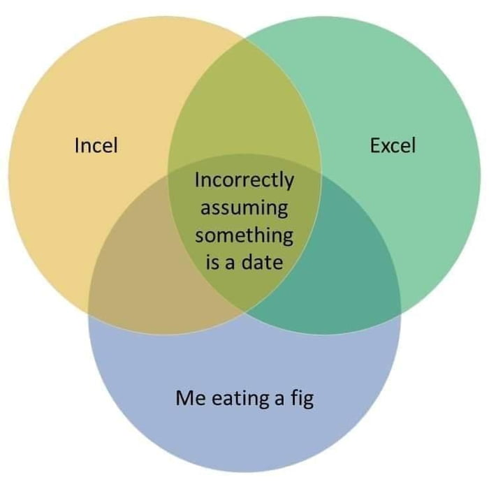
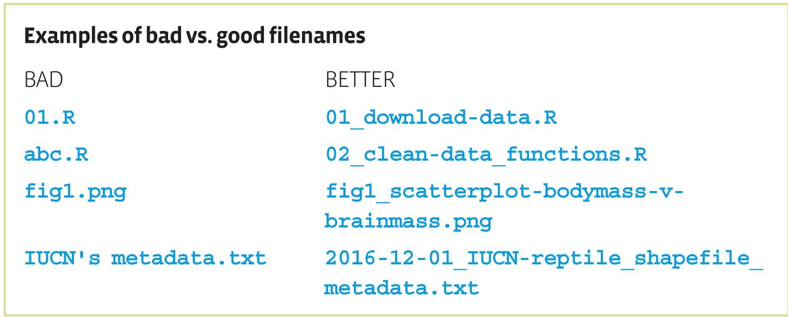
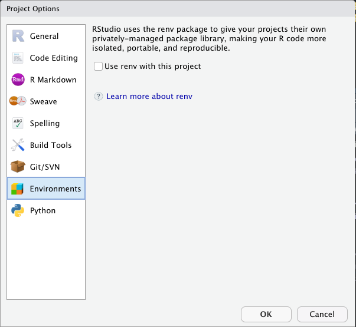

```{r setup, include=FALSE}
options(htmltools.dir.version = FALSE)
library(knitr)
library(tidyverse)
```


# Reproducibility: why bother?

- For future you

--

- For collaborators

--

- Because you want people to use and appreciate your data and code (networking!)

--

- Open Science!

--

- Because it is encouraged or required by a journal

---
class: center, middle, inverse

# Organizing Files

---
# Research Compendium
A research compendium is a collection of all the digital parts of a research project including:

- data, both raw and intermediate
- code
- documentation
- figures
- notes
- protocols
- reports

Ideally, these should be bundled in a way that makes it clear how all the pieces fit together, and is reproducible by other researchers and your future self.
---

# Directory Structure

At minimum, separate data from code and outputs.

.pull-left[
Minimally:

`r emo::ji("folder")` data

`r emo::ji("folder")` analysis

`r emo::ji("folder")` output

`r emo::ji("document")` README.md
]

.pull-right[
I like:

`r emo::ji("folder")` data
 - `r emo::ji("folder")` raw_data
 - `r emo::ji("folder")` cleaned_data
 - `r emo::ji("document")` README.md
 
`r emo::ji("folder")` wrangling

`r emo::ji("folder")` analysis

`r emo::ji("folder")` docs
  - `r emo::ji("folder")` figures
  
`r emo::ji("document")` README.md
]


---

# Don't edit raw data!

.pull-left[
Never edit raw data directly. Do all data manipulation programatically when possible.

- Keeps a record of all changes made to data

- Minimize accidental changes in data

- Consider making raw data files read-only

- Avoid Excel as it greedily converts things to dates!

- If you must edit manually, work on a copy and document the changes
]
.pull-right[

]
---

# File naming



Considering alphabetical ordering of numbers
- Numbering (`01_wrangle-data.Rmd`, `02_analyze-data.Rmd`)
- Dates using ISO format (YYYY-MM-DD) (`2021-05-24_BDFFP-data.csv`)

---
class: center, middle, inverse

# Documentation

---
# Commenting code

Bad:
```{r}
mean(iris[iris$Species=="setosa",]$Sepal.Length*iris[iris$Species=="setosa",]$Sepal.Width)
```

Good (split into steps, commented, some formatting):
```{r}
# subset to just setosa
iris_setosa <- iris[iris$Species == "setosa", ]
# calculate an "area" of the sepals
iris_setosa$square_area <-
  iris_setosa$Sepal.Length * iris_setosa$Sepal.Width
mean(iris_setosa$square_area)
```

**Tip:** You can automatically format your code in RStudio with *Code > Reformat Code*
---
# Commenting code

Better (**literate programming** + comments):
```{r}
iris %>%
  filter(Species == "setosa") %>% 
  # calculate "area" of sepals
  mutate(square_area = Sepal.Length * Sepal.Width) %>% 
  summarize(mean_sq_area = mean(square_area))
```
One advantage of using the `tidyverse` packages is code that is more human readable, and you often need fewer comments to make it clear.

---
# RMarkdown

- Allows you to combine prose (markdown), code, and code output in one document

- Great way to keep an analysis "lab notebook"

- Creates nifty looking reports in HTML, pdf, Word using the `knitr` package

RMarkdown is not essential to reproducible code, but I personally find it helps me work though analyses and can eventually be turned into a report, or even into a simpler .R file with `knitr::purl()`


.center[ [demo] ]

---
# Metadata

Metadata is documentation of data—how, where, when, and by whom it was collected.

Emilio has an entire lecture on metadata, if you want to go into depth.

At minimum, for "rectangular" data (a dataframe):

- What experiment is the dataset from?

- What do the column names mean?

- What are the units?

- What values should be expected and what do they mean?

Put this in a `README.md` or `metadata.md` inside your `data` folder.


---
class: center, middle, inverse

# Working Toward Reproducibility

---

# Reproduce on your own machine

- Restart R and run your script from top to bottom to check for reproducibility

- In .R files, *Session > Restart R*, then click the "source" button

- In R Markdown, choose "Restart R and Run all Chunks" from either the "Run" button drop-down or the *Session* menu.

- If one script depends on code in another script, use `source()`

.center[[demo]]

---

# File paths in code

If I send you code that starts with the following lines, what are some problems you're going to have?

```r
setwd("~/Documents/myanalysis")
df <- read.csv("data/mydata.csv")
```

--

- Different working directory

--

- "`~`" and "`/`" are linux & macOS things and maybe you are running Windows

--

- Not totally clear where to put `mydata.csv` relative to the script
---

# File path solutions:

1. Use RStudio Projects—file paths are relative
  - Working directory is always wherever the `.Rproj` file is by default.
  - Share entire Project folder when collaborating

3. Use the `here` package:

```{r}
library(here)
```

Instead of ...
```r
read.csv("/Users/scottericr/Documents/reproducibility-presentation/data/trees.csv")
```
... use ...
```r
read.csv(here("data", "trees.csv"))
```

and it will work on any system!


---
# Package versions

.pull-left[
Your code works now, but what if a key package gets updated or taken off CRAN?  What if your collaborator has a different version of a package installed?

The `renv` package keeps track of the specific versions of every package your project uses in a "lockfile".

Can be initiated at the start, middle, or end of a project.
]
.pull-right[

]

---
# Docker Container

A Docker Container is basically a self-contained, minimial, emulated computer that can run on any computer. It contains all the software dependencies and system libraries needed for your research compendium (or other software).

The [`holepunch` package](https://karthik.github.io/holepunch/index.html) makes it relatively easy to set up a Docker container for your research compendium. When someone clicks the  button on your repository, it opens your exact RStudio session *in a web browser*!

.center[[[demo](https://github.com/karthik/binder-test)]]

---
# Create an R Package?

Some folks strongly believe that an R package is the perfect format for a reproducible research compendium.  **I am not one of those people.**

Creating an R package is not hard, but it does require extra effort and learning, and the payoff varies.

**However**, I do think R packages are a great way to share your *functions* and maybe sometimes your *data* if you expect them to be used by a wider community.

Check out https://r-pkgs.org/ if you want to try your hand at building an R package.


---
# Programming

---

# Don't Repeat Yourself (DRY)

If you find yourself writing the same code 3+ times, consider writing a function. Functions let you re-use code and reduce mistakes when copying or updating code.

To define a function in R, you use the `function()` function:

```{r}
add_ten <- function(x) {
  x + 10
}
add_ten(7)
```

--

The same sorts of rules for file names apply to function names. 

Clear, concise verbs are best— `clean_ha_data()`, `calc_dist()`, `plot_ha_results()`

Alternatively, consider a common prefix to make autocomplete work for you—`ha_clean()`, `ha_calc_dist()`, `ha_plot()`
---

# Functions

RStudio can help you get started with *Code > Extract Function*.  

It turns this:
```r
x <- c(1,5,10)
y <- 100

x * 2 + y
```

Into:

```{r}
my_fun <- function(x, y) {
  x * 2 + y
}
```

Which let's you reuse code:
```{r}
my_fun(x = c(5,6,7), y = 10)
```
.center[[demo]]
---
# Create an R Package

If you find yourself creating **a lot** of functions and using those functions in multiple scripts or projects, consider bundling them into a package.  It doesn't have to be on CRAN! It can be just for you

<!-- add image or something -->

---
class: center, middle, inverse

# Takeaways

---
# Takeaways

1. Organize your work as a **Research Compendium**

2. Document data, code, and file structure so it is understandable by others and future you

3. Start writing reproducible code using the `here` package and by restarting R often

4. Work toward more widely reproducible code by trying out the `renv` package or maybe even with a Docker file

5. Avoid repetitive code by writing well-named and documented functions
